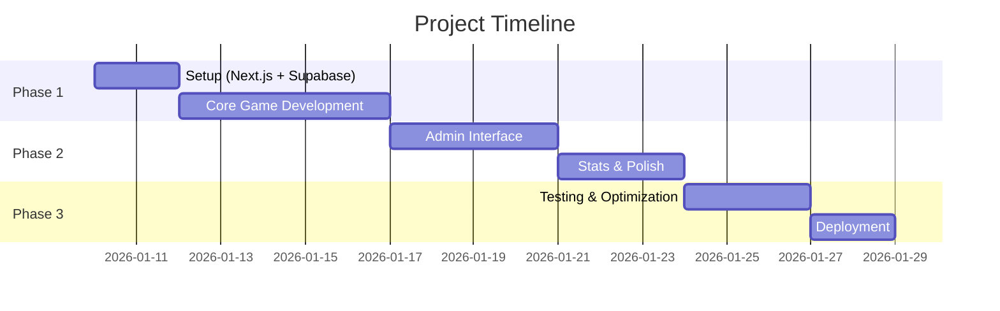

# 📋 Project Brief - Red or Green Game

> **Project briefing document to align all stakeholders**

## 📌 General Information

| Field | Value |
|-------|-------|
| **Project Name** | Red or Green Game |
| **Project Code** | ROG-MVP-001 |
| **Start Date** | January 10, 2026 |
| **Target Date** | January 31, 2026 (2-3 weeks) |
| **Sponsor** | Solo Founder (non-technical) |
| **Project Lead** | AI Development Agent |
| **Team** | AI Agent + Human Founder (content) |

---

## 🎯 Executive Summary

### The Problem
Party games for young adults (16-26) are often too complex to start quickly, fail to create genuine engagement, or don't spark the debates and laughter that make parties memorable.

### The Solution
A mobile-first web game where players choose between two options which one is the biggest "Red Flag" (negative sign). Instant results show what the majority thinks, creating instant debate and engagement.

### Expected Impact
- Validate the viral game concept with ~15 real users
- Create a foundation for scalable social gaming content
- Generate shareable statistics that drive organic growth

---

## 🏁 Project Objectives

### Primary Objective
> Build a fully functional MVP that allows users to play an infinite series of Red Flag duels with real-time statistics and zero friction.

### Secondary Objectives
1. Implement an intelligent ELO-based ranking system for meaningful statistics from day one
2. Create an admin interface for content management
3. Achieve < 200ms latency for all player interactions

### Success Criteria (Definition of Done)
- [ ] 95%+ of votes processed in < 200ms
- [ ] 70%+ of test players complete at least 10 duels
- [ ] 200 content elements created and categorized
- [ ] Admin can CRUD elements without technical knowledge
- [ ] Mobile-first responsive design working on all smartphones

---

## 📐 Scope

### ✅ In Scope

| # | Feature | Priority | Notes |
|---|---------|----------|-------|
| 1 | Profile Form (sex + age) | Must Have | LocalStorage, no account |
| 2 | Two-zone clickable game interface | Must Have | 50% screen each, mobile-first |
| 3 | Vote recording + ELO calculation | Must Have | < 20ms ELO calculation |
| 4 | Result display with animation | Must Have | 1.2s animation, skippable |
| 5 | Intelligent duel selection algorithm | Must Have | 50/30/15/5 distribution |
| 6 | Streak system | Must Have | LocalStorage based |
| 7 | Admin authentication | Must Have | Simple email + password |
| 8 | Admin CRUD for elements | Must Have | Create, Read, Update, Deactivate |
| 9 | Admin basic dashboard | Must Have | Total votes, active elements |
| 10 | Global ELO rankings | Must Have | Top Red/Green flags |
| 11 | Star + Thumbs feedback | Should Have | After result display |
| 12 | Segmented ELO statistics | Should Have | By sex, by age |
| 13 | CSV exports | Should Have | Admin feature |
| 14 | Back button to previous result | Should Have | LocalStorage history |
| 15 | Advanced animations | Could Have | Confetti, elaborate transitions |
| 16 | Social sharing button | Could Have | Simple implementation |

### ❌ Out of Scope

| # | Element | Reason |
|---|---------|--------|
| 1 | User accounts / Login | Adds friction, not needed for MVP |
| 2 | Personal vote history | Complexity without party value |
| 3 | Native mobile app (iOS/Android) | Web is sufficient |
| 4 | Push notifications | Unnecessary for MVP |
| 5 | Sound / Music | Party context already noisy |
| 6 | Offline mode | Always connected context |
| 7 | Community content submission | V2 feature |
| 8 | Monetization / Ads | Test concept first |
| 9 | Full GDPR compliance | Anonymous data only |
| 10 | Advanced analytics (Mixpanel, etc.) | Keep it simple |

---

## 👥 Stakeholders

### RACI Matrix

| Activity | Founder | AI Agent | Content | Tester |
|----------|---------|----------|---------|--------|
| Validate specs | A | R | C | I |
| Development | I | R | - | - |
| Content creation | A | C | R | I |
| Testing | C | A | C | R |
| Final validation | R | A | C | C |

*R = Responsible, A = Accountable, C = Consulted, I = Informed*

---

## 📊 Constraints and Dependencies

### Constraints

| Type | Description | Impact |
|------|-------------|--------|
| Budget | €0 for hosting (free tiers) | Must use Vercel + Supabase free plans |
| Time | 2-3 weeks to MVP | Focus on Must Have features only |
| Technical | Founder non-technical | Must be simple to maintain |
| Resources | Solo founder + AI agent | No dedicated QA team |

### Dependencies

| # | Dependency | Responsible | Required Date | Status |
|---|------------|-------------|---------------|--------|
| 1 | 200 content elements created | Founder | Week 1 | 🟡 In Progress |
| 2 | Supabase account setup | AI Agent | Day 1 | ⚪ Not Started |
| 3 | Vercel deployment configured | AI Agent | Day 1 | ⚪ Not Started |

---

## ⚠️ Identified Risks

| # | Risk | Probability | Impact | Mitigation |
|---|------|-------------|--------|------------|
| 1 | Performance < 200ms not achievable | Low | Critical | Preloading, in-memory ELO calculation, profiling |
| 2 | Content not engaging enough | Medium | High | Iterate based on star/thumbs feedback |
| 3 | LocalStorage limits reached | Low | Medium | Cap at 200 duels per session, clear option |
| 4 | ELO calculations too slow | Low | Critical | Async segmented ELO, sync global only |
| 5 | Supabase free tier limits | Low | Medium | Monitor usage, upgrade if needed |

---

## 🗓️ Key Milestones



| Milestone | Target Date | Deliverable |
|-----------|-------------|-------------|
| M1: Setup Complete | Jan 12, 2026 | Next.js + Supabase + Tables |
| M2: Core Game Ready | Jan 17, 2026 | Playable game with ELO |
| M3: Admin Ready | Jan 21, 2026 | CRUD + Dashboard |
| M4: Polish Complete | Jan 24, 2026 | Should Have features |
| M5: Go-Live | Jan 27, 2026 | Production deployment |

---

## 💻 Technical Requirements

### Technology Stack
```yaml
Frontend: Next.js 14 (App Router) + TailwindCSS + Framer Motion
Backend: Next.js API Routes (Serverless)
Database: PostgreSQL (via Supabase)
State: Zustand (lightweight) + LocalStorage
Hosting: Vercel (frontend + API) + Supabase (database)
Cost: €0 (free tiers)
```

### Non-Functional Requirements
| Category | Requirement | Target |
|----------|-------------|--------|
| Performance | Vote processing time | < 200ms (95th percentile) |
| Performance | ELO calculation | < 20ms |
| Performance | Animation framerate | 60fps (GPU-accelerated) |
| Availability | Uptime | 99% (acceptable for MVP) |
| Scalability | Concurrent users | ~15 (MVP test phase) |
| Compatibility | Mobile browsers | iOS Safari, Android Chrome |

---

## 📞 Communication

### Regular Meetings
| Meeting | Frequency | Participants | Objective |
|---------|-----------|--------------|----------|
| Progress Review | Daily | Founder + AI | Check progress, blockers |
| Content Review | As needed | Founder | Validate new elements |

### Communication Channels
- **Documentation:** This SDD repository
- **Code:** Git repository
- **Deployment:** Vercel dashboard

---

## ✅ Approvals

| Role | Name | Signature | Date |
|------|------|-----------|------|
| Founder/Sponsor | [Solo Founder] | ✅ | Jan 10, 2026 |
| AI Architect | Claude | ✅ | Jan 10, 2026 |

---

## 📝 Revision History

| Version | Date | Author | Changes |
|---------|------|--------|---------|
| 1.0 | Jan 10, 2026 | AI Architect | Initial validated version |
| 1.1 | Jan 12, 2026 | AI Developer | Ready for development |

---

🚦 **Gate:** This document is APPROVED - Ready to proceed with functional specifications.
