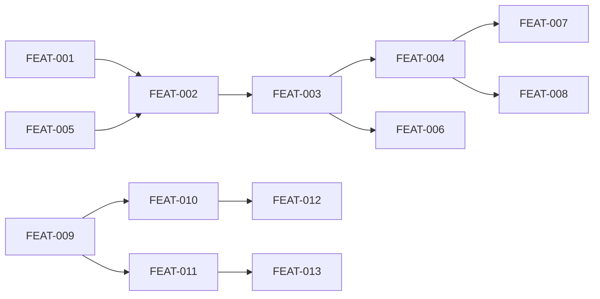

# 📋 Functional Specifications - Red or Green Game

> **Detailed functional specifications document**

---

## 📌 Document Information

| Field | Value |
|-------|-------|
| **Version** | 1.0 |
| **Status** | ✅ Approved |
| **Last Update** | January 12, 2026 |
| **Author** | AI Architect |
| **Reviewers** | Solo Founder |

---

## 🎯 Document Objective

This document describes the **expected functional behaviors** of the system. It serves as a contract between the product and development teams, and constitutes the **source of truth** for AI agents during implementation.

---

## 📐 Documentation Convention

### Specification Format
Each specification follows this format:

```yaml
ID: [FEAT-XXX]
Title: [Descriptive name]
Priority: [P0/P1/P2/P3]
Status: [To Do/In Progress/Done]
Description: [Detailed description]
Pre-conditions: [What must be true before]
Post-conditions: [What must be true after]
Actors: [Who interacts]
Trigger: [What triggers the feature]
Main Flow: [Normal steps]
Alternative Flows: [Variants]
Error Cases: [Error handling]
Business Rules: [Rules to respect]
```

---

## 🏷️ Module 1: Player Game Experience

### FEAT-001: Profile Form

#### General Information
| Attribute | Value |
|-----------|-------|
| **ID** | FEAT-001 |
| **Priority** | P0 - Must Have |
| **Status** | To Do |
| **Complexity** | Low |
| **Target Sprint** | Sprint 1 |

#### Description
> Players must provide basic demographic information (sex and age) before playing. This data is used for segmented statistics and is stored locally only (no account creation).

#### Actors
- **Primary Actor:** Player
- **Secondary Actors:** None

#### Pre-conditions
- [ ] Player has accessed the landing page
- [ ] LocalStorage is available in browser

#### Trigger
> Player clicks "Play" button on landing page

#### Main Flow (Happy Path)

| Step | Actor | Action | System Result |
|------|-------|--------|---------------|
| 1 | Player | Clicks "Play" button | Display profile form |
| 2 | Player | Selects sex option | Option highlighted |
| 3 | Player | Selects age range | Option highlighted |
| 4 | Player | Clicks "Start" button | Validate inputs |
| 5 | System | Save to LocalStorage | Store profile |
| 6 | System | Navigate to game | Display first duel |

#### Alternative Flows

**ALT-1: Profile already exists in LocalStorage**
- Condition: LocalStorage contains valid profile
- At step 1:
  1. System detects existing profile
  2. Skip to game interface directly
  3. End

**ALT-2: Player wants to change profile**
- Condition: Player clicks "New Game" or clears session
- 1. Clear LocalStorage
- 2. Return to step 1 of main flow

#### Error Cases

| Code | Condition | User Message | System Action |
|------|-----------|--------------|----------------|
| ERR-001 | Sex not selected | "Please select your sex" | Highlight field |
| ERR-002 | Age not selected | "Please select your age range" | Highlight field |
| ERR-003 | LocalStorage unavailable | "Please enable cookies" | Display error |

#### Business Rules

| ID | Rule | Validation |
|----|------|------------|
| BR-001 | All fields are mandatory | Form validation |
| BR-002 | Sex options: Homme, Femme, Non-binaire, Autre | Enum validation |
| BR-003 | Age ranges: 16-18, 19-22, 23-26, 27+ | Enum validation |

#### Post-conditions
- [ ] Profile stored in LocalStorage
- [ ] Session initialized (seenDuels: [], streak: 0)
- [ ] Player redirected to game interface

#### User Interface

```
┌─────────────────────────────────────────┐
│              RED OR GREEN               │
│              🔴    🟢                   │
├─────────────────────────────────────────┤
│                                         │
│  Quel est ton sexe ?                    │
│  [Homme] [Femme] [Non-binaire] [Autre]  │
│                                         │
│  Quel âge as-tu ?                       │
│  [16-18] [19-22] [23-26] [27+]          │
│                                         │
│         [ 🎮 JOUER ]                    │
│                                         │
└─────────────────────────────────────────┘
```

#### Required Data

| Field | Type | Required | Validation | Default |
|-------|------|----------|------------|---------|
| sex | enum | Yes | One of 4 options | - |
| age | enum | Yes | One of 4 ranges | - |

---

### FEAT-002: Duel Display Interface

#### General Information
| Attribute | Value |
|-----------|-------|
| **ID** | FEAT-002 |
| **Priority** | P0 - Must Have |
| **Status** | To Do |
| **Complexity** | Medium |
| **Target Sprint** | Sprint 1 |

#### Description
> Display two elements as large clickable zones, each occupying 50% of the screen height. Elements are selected using the intelligent algorithm. Interface must be optimized for phone-passing scenario.

#### Actors
- **Primary Actor:** Player
- **Secondary Actors:** None

#### Pre-conditions
- [ ] Player has completed profile form
- [ ] Active elements exist in database
- [ ] Session initialized in LocalStorage

#### Trigger
> Profile form submitted OR "Next" clicked after result

#### Main Flow (Happy Path)

| Step | Actor | Action | System Result |
|------|-------|--------|---------------|
| 1 | System | Apply selection algorithm | Select 2 elements |
| 2 | System | Verify not in seenDuels | Confirm unique |
| 3 | System | Display duel interface | Show 2 zones |
| 4 | Player | Clicks one zone | Register vote |

#### Alternative Flows

**ALT-1: All duels exhausted**
- Condition: All possible pairs in seenDuels
- 1. Display "You've seen it all!" message
- 2. Show "New Game" button
- 3. End

#### Business Rules

| ID | Rule | Validation |
|----|------|------------|
| BR-004 | Each zone = 50% screen height | CSS layout |
| BR-005 | Text must be readable from arm's length | Font size >= 24px |
| BR-006 | Never show same duel twice in session | LocalStorage check |

#### Post-conditions
- [ ] Two elements displayed clearly
- [ ] Both zones are clickable
- [ ] Next duel preloaded in background

#### User Interface

```
┌────────────────────────────────────────┐
│                                        │
│                                        │
│           ÊTRE POLICIER                │
│                                        │
│         (Clickable Zone 50%)           │
│                                        │
├────────────────────────────────────────┤
│                                        │
│                                        │
│          AIMER LES PIEDS               │
│                                        │
│         (Clickable Zone 50%)           │
│                                        │
└────────────────────────────────────────┘
```

---

### FEAT-003: Vote Recording & ELO Calculation

#### General Information
| Attribute | Value |
|-----------|-------|
| **ID** | FEAT-003 |
| **Priority** | P0 - Must Have |
| **Status** | To Do |
| **Complexity** | High |
| **Target Sprint** | Sprint 1 |

#### Description
> When player clicks a zone, record the vote in database, calculate new ELO scores synchronously for global ELO, and trigger async calculation for segmented ELO.

#### Actors
- **Primary Actor:** Player (implicit via click)
- **Secondary Actors:** Background worker (async ELO)

#### Pre-conditions
- [ ] Duel displayed on screen
- [ ] Elements are active in database
- [ ] Player profile available in LocalStorage

#### Trigger
> Player clicks on one of the two zones

#### Main Flow (Happy Path)

| Step | Actor | Action | System Result |
|------|-------|--------|---------------|
| 1 | Player | Clicks element zone | Capture winner ID |
| 2 | System | Validate vote | Check elements active |
| 3 | System | Insert into VOTES table | Store vote with metadata |
| 4 | System | Calculate global ELO (sync) | Update both elements |
| 5 | System | Trigger async ELO | Background job started |
| 6 | System | Add to seenDuels | Update LocalStorage |
| 7 | System | Update streak | Calculate majority match |
| 8 | System | Navigate to results | Display animation |

#### Error Cases

| Code | Condition | User Message | System Action |
|------|-----------|--------------|----------------|
| ERR-004 | Element deactivated since display | "This duel is no longer available" | Load new duel |
| ERR-005 | Network error | "Connection error, retrying..." | Retry 3x |
| ERR-006 | ELO calculation timeout | None (silent) | Log and continue |

#### Business Rules

| ID | Rule | Validation |
|----|------|------------|
| BR-007 | ELO calculation < 20ms | Performance monitoring |
| BR-008 | K-factor = 32 for ELO updates | Hardcoded constant |
| BR-009 | Async ELO can lag up to 2 minutes | Acceptable delay |

#### ELO Calculation Logic
```
Expected = 1 / (1 + 10^((ELO_Loser - ELO_Winner) / 400))
New_Winner_ELO = Old_Winner_ELO + K * (1 - Expected)
New_Loser_ELO = Old_Loser_ELO + K * (0 - (1 - Expected))
```

#### Post-conditions
- [ ] Vote recorded in VOTES table
- [ ] Global ELO updated for both elements
- [ ] Async job triggered for segmented ELO
- [ ] SeenDuels updated in LocalStorage
- [ ] Streak updated in LocalStorage

---

### FEAT-004: Result Display with Animation

#### General Information
| Attribute | Value |
|-----------|-------|
| **ID** | FEAT-004 |
| **Priority** | P0 - Must Have |
| **Status** | To Do |
| **Complexity** | Medium |
| **Target Sprint** | Sprint 1 |

#### Description
> After a vote, display an animated result showing percentages (based on ELO estimation), vote counts per element, and the player's current streak. The winning zone animates to expand proportionally.

#### Pre-conditions
- [ ] Vote successfully recorded
- [ ] ELO scores available for percentage estimation

#### Trigger
> Vote recording completed

#### Main Flow (Happy Path)

| Step | Actor | Action | System Result |
|------|-------|--------|---------------|
| 1 | System | Calculate ELO percentage | Estimate winner % |
| 2 | System | Start animation | Winner zone expands |
| 3 | System | Display percentages | Show both % values |
| 4 | System | Display vote counts | Show per-element votes |
| 5 | System | Update streak display | Show current streak |
| 6 | System | Show feedback buttons | Star + Thumbs |
| 7 | System | Start auto-advance timer | 3 second countdown |
| 8 | Player | Clicks "Next" OR waits 3s | Load next duel |

#### Alternative Flows

**ALT-1: Player skips animation**
- Condition: Player clicks anywhere during animation
- 1. Complete animation instantly
- 2. Show full result immediately
- 3. Continue from step 7

#### Business Rules

| ID | Rule | Validation |
|----|------|------------|
| BR-010 | Animation duration = 1.2s | Timing |
| BR-011 | Animation must be 60fps | Performance |
| BR-012 | Use CSS transforms only (GPU) | Code review |
| BR-013 | Auto-advance after 3s if no action | Timer |
| BR-014 | Percentage = ELO estimation, not direct votes | Logic |

#### User Interface (Post-Animation)

```
┌────────────────────────────────────────┐
│                                        │
│           ÊTRE POLICIER                │
│           68% 🔴                       │
│           1,247 participations         │
│              (68% height)              │
│                                        │
├────────────────────────────────────────┤
│          AIMER LES PIEDS               │
│           32% 🟢    (32% height)       │
│           983 participations           │
├────────────────────────────────────────┤
│  Streak: 5 🔥    ⭐ Star   👍 👎      │
│          [ Suivant → ]                 │
└────────────────────────────────────────┘
```

---

### FEAT-005: Intelligent Duel Selection Algorithm

#### General Information
| Attribute | Value |
|-----------|-------|
| **ID** | FEAT-005 |
| **Priority** | P0 - Must Have |
| **Status** | To Do |
| **Complexity** | Medium |
| **Target Sprint** | Sprint 1 |

#### Description
> Algorithm that selects the next duel based on a weighted distribution: 50% ELO-close duels, 30% cross-category, 15% starred duels, 5% random. Prevents duplicates and ensures variety.

#### Business Rules

| ID | Rule | Validation |
|----|------|------------|
| BR-015 | ELO-close = 50-300 point difference | Algorithm |
| BR-016 | If no ELO-close available, expand range | Fallback |
| BR-017 | Cross-category = different categories | Algorithm |
| BR-018 | Starred minimum = 50 stars to qualify | Threshold |
| BR-019 | If < 50 total stars, redistribute 15% | Fallback |
| BR-020 | Never return duel in seenDuels | Validation |

#### Algorithm Pseudocode
```
function selectDuel(elements, seenDuels, starredDuels):
    random = Math.random()
    
    if random < 0.15 AND starredDuels.length > 0:
        return pickStarredDuel(starredDuels, seenDuels)
    else if random < 0.45:
        return pickCrossCategory(elements, seenDuels)
    else if random < 0.95:
        return pickELOClose(elements, seenDuels)
    else:
        return pickRandom(elements, seenDuels)
```

---

### FEAT-006: Streak System

#### General Information
| Attribute | Value |
|-----------|-------|
| **ID** | FEAT-006 |
| **Priority** | P0 - Must Have |
| **Status** | To Do |
| **Complexity** | Low |
| **Target Sprint** | Sprint 1 |

#### Description
> Track how many consecutive times the player has voted with the "majority" (defined by ELO probability). Display with fire emojis at thresholds.

#### Business Rules

| ID | Rule | Validation |
|----|------|------------|
| BR-021 | "Majority" = element with higher ELO-estimated % | Logic |
| BR-022 | Match = streak + 1 | Increment |
| BR-023 | Mismatch = streak reset to 0 | Reset |
| BR-024 | Display: 5+ = 🔥, 10+ = 🔥🔥, 20+ = 🔥🔥🔥 | UI |
| BR-025 | Store in LocalStorage only | Persistence |
| BR-026 | Reset on page refresh | Behavior |

---

## 🏷️ Module 2: Feedback System

### FEAT-007: Star a Duel

#### General Information
| Attribute | Value |
|-----------|-------|
| **ID** | FEAT-007 |
| **Priority** | P1 - Should Have |
| **Status** | To Do |
| **Complexity** | Low |
| **Target Sprint** | Sprint 2 |

#### Description
> Allow players to mark a duel as particularly interesting. Starred duels appear more frequently in the algorithm.

#### Pre-conditions
- [ ] Result displayed on screen
- [ ] Player has not starred this duel in current session

#### Business Rules

| ID | Rule | Validation |
|----|------|------------|
| BR-027 | One star per duel per session | LocalStorage check |
| BR-028 | Store in DUEL_FEEDBACK table | Database |
| BR-029 | Increment stars_count | Update |

---

### FEAT-008: Thumbs Feedback

#### General Information
| Attribute | Value |
|-----------|-------|
| **ID** | FEAT-008 |
| **Priority** | P1 - Should Have |
| **Status** | To Do |
| **Complexity** | Low |
| **Target Sprint** | Sprint 2 |

#### Description
> Allow players to give quick thumbs up/down feedback on duel quality for admin review.

---

## 🏷️ Module 3: Admin Interface

### FEAT-009: Admin Authentication

#### General Information
| Attribute | Value |
|-----------|-------|
| **ID** | FEAT-009 |
| **Priority** | P0 - Must Have |
| **Status** | To Do |
| **Complexity** | Low |
| **Target Sprint** | Sprint 2 |

#### Description
> Simple email + password authentication for a single admin user. Credentials stored in environment variables.

#### Business Rules

| ID | Rule | Validation |
|----|------|------------|
| BR-030 | Credentials from ADMIN_EMAIL, ADMIN_PASSWORD_HASH env vars | Config |
| BR-031 | Password stored as bcrypt hash | Security |
| BR-032 | Session via JWT or Supabase Auth | Implementation |
| BR-033 | No multi-user, no OAuth | Simplicity |

---

### FEAT-010: Elements CRUD

#### General Information
| Attribute | Value |
|-----------|-------|
| **ID** | FEAT-010 |
| **Priority** | P0 - Must Have |
| **Status** | To Do |
| **Complexity** | Medium |
| **Target Sprint** | Sprint 2 |

#### Description
> Full CRUD operations for game elements: Create, Read (list with filters), Update, Deactivate/Reactivate.

#### Business Rules

| ID | Rule | Validation |
|----|------|------------|
| BR-034 | Create: Initialize ELO at 1000 for all segments | Default |
| BR-035 | Update: Preserve ELO scores | Logic |
| BR-036 | Deactivate: Element excluded from duels | Flag |
| BR-037 | Reactivate: Element returns to pool | Flag |
| BR-038 | Confirmation popup for deactivate/delete | UX |

---

### FEAT-011: Admin Dashboard

#### General Information
| Attribute | Value |
|-----------|-------|
| **ID** | FEAT-011 |
| **Priority** | P0 - Must Have |
| **Status** | To Do |
| **Complexity** | Medium |
| **Target Sprint** | Sprint 2 |

#### Description
> Dashboard displaying key metrics: total votes, active elements, active sessions (24h), average duels per session, average latency.

---

### FEAT-012: ELO Rankings

#### General Information
| Attribute | Value |
|-----------|-------|
| **ID** | FEAT-012 |
| **Priority** | P0 - Must Have |
| **Status** | To Do |
| **Complexity** | Low |
| **Target Sprint** | Sprint 2 |

#### Description
> Display Top 10 Red Flags (highest ELO) and Top 10 Green Flags (lowest ELO). Optional filters by category and segment.

---

### FEAT-013: CSV Export

#### General Information
| Attribute | Value |
|-----------|-------|
| **ID** | FEAT-013 |
| **Priority** | P1 - Should Have |
| **Status** | To Do |
| **Complexity** | Low |
| **Target Sprint** | Sprint 2 |

#### Description
> Export elements and votes data to CSV for social media content creation.

#### Business Rules

| ID | Rule | Validation |
|----|------|------------|
| BR-039 | Separator: `;` (Excel French compatible) | Format |
| BR-040 | Encoding: UTF-8 with BOM | Format |
| BR-041 | Filename: redorgreen_export_YYYYMMDD_HHMMSS.csv | Naming |

---

## 📊 Feature Matrix

| ID | Feature | Module | Priority | Status | Sprint |
|----|---------|--------|----------|--------|--------|
| FEAT-001 | Profile Form | Player | P0 | ⚪ To Do | 1 |
| FEAT-002 | Duel Display | Player | P0 | ⚪ To Do | 1 |
| FEAT-003 | Vote & ELO | Player | P0 | ⚪ To Do | 1 |
| FEAT-004 | Result Animation | Player | P0 | ⚪ To Do | 1 |
| FEAT-005 | Duel Selection | Player | P0 | ⚪ To Do | 1 |
| FEAT-006 | Streak System | Player | P0 | ⚪ To Do | 1 |
| FEAT-007 | Star Feedback | Feedback | P1 | ⚪ To Do | 2 |
| FEAT-008 | Thumbs Feedback | Feedback | P1 | ⚪ To Do | 2 |
| FEAT-009 | Admin Auth | Admin | P0 | ⚪ To Do | 2 |
| FEAT-010 | Elements CRUD | Admin | P0 | ⚪ To Do | 2 |
| FEAT-011 | Dashboard | Admin | P0 | ⚪ To Do | 2 |
| FEAT-012 | ELO Rankings | Admin | P0 | ⚪ To Do | 2 |
| FEAT-013 | CSV Export | Admin | P1 | ⚪ To Do | 2 |

---

## 🔗 Feature Dependencies



| Feature | Depends On |
|---------|------------|
| FEAT-002 | FEAT-001, FEAT-005 |
| FEAT-003 | FEAT-002 |
| FEAT-004 | FEAT-003 |
| FEAT-006 | FEAT-003 |
| FEAT-007 | FEAT-004 |
| FEAT-010 | FEAT-009 |
| FEAT-011 | FEAT-009 |
| FEAT-012 | FEAT-010 |

---

## 📝 Glossary

| Term | Definition |
|------|------------|
| Element | A single option that can appear in a duel (e.g., "Être policier") |
| Duel | A comparison between two elements where player chooses the bigger Red Flag |
| ELO | Rating system borrowed from chess, used to rank elements |
| Red Flag | Negative trait, behavior, or characteristic |
| Green Flag | Positive trait, behavior, or characteristic |
| Streak | Consecutive times player matched the majority opinion |
| Session | A single play session stored in LocalStorage (resets on refresh) |
| Segment | Demographic grouping (sex or age range) |

---

## 📝 Revision History

| Version | Date | Author | Changes |
|---------|------|--------|---------|
| 1.0 | Jan 12, 2026 | AI Architect | Complete functional specs |

---

🚦 **Gate:** Functional specifications APPROVED - Ready for technical specifications.

## ✅ Approval

| Role | Name | Date | Signature |
|------|------|------|-----------|
| Founder | Solo Founder | Jan 12, 2026 | ✅ |
| AI Architect | Claude | Jan 12, 2026 | ✅ |
